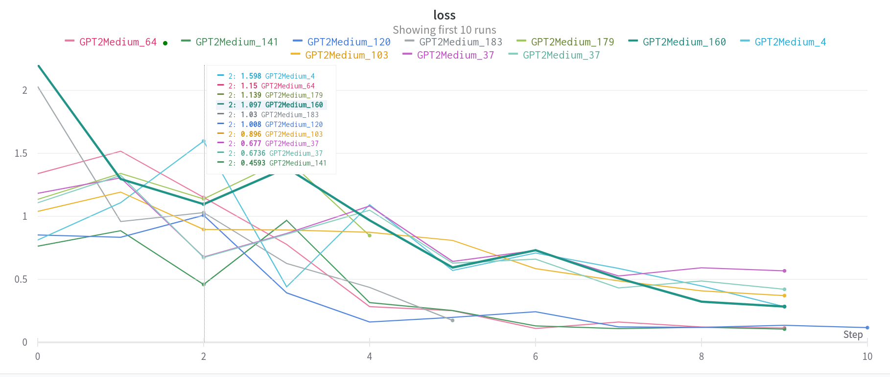

# iNLP Project Report

Transformer (GPT-2) fine tuned on the chat_data.json dataset

<br>

## To run the program :
Download the model from the link given below and place it in the same folder as the question_answer.py file (in models folder)

```bash
python3 question_answer.py
```

To train the model from scratch, run the following command :

```bash
python3 main.py
```

<br>

---

<br>

## Change log

* (20/03/2023) :
    - Made some basic changes and played around with the model using hyperparameter tuning

<br>

* (21/03/2023) :
    - Changed the model to a GPT2-Medium model
    - Changed the dataset to cover more context
    - Did some hyperparameter tuning according to the new dataset
    - File structure changes ( all the new changes will be done in Final Model folder and not in the 'Styled on a different dataset' folder)


* (21/04/2023) : 
  - Added a seed to see which one performs the best
  - Added WandB to store the models and compare their performances ( https://wandb.ai/mhardik003/iNLP_Project)
  - Changed the optimizer to AdamW as recommended by a lot of online resources
  - Changed the learning rate to 1e-5 as recommended by a lot of online resources
  

* (22/04/2023) :
 - Added scheduler
 - Froze the first 6 layers of the model


---

<br>

### GitHub Link : https://github.com/JainitBITW/Styled_ChatBot

### Link to the model : https://iiitaphyd-my.sharepoint.com/:u:/g/personal/jainit_bafna_research_iiit_ac_in/ERDe5zst57hDu97-ybEYLDUBSXKEt7_9U0Gcqr4GcXczLA?e=bXs17g


<br>

---

### Introduction

> This project involves fine-tuning a generative model to mimic a person's way of speaking by training it on their chat data. The objective is to create a system that can generate text that closely resembles the person's style and patterns of communication. This approach has potential applications in various fields such as chat-bots, virtual assistants, and personalized content creation. The success of the project will depend on the quality and quantity of the training data and the effectiveness of the chosen generative model for the task.
> 

---

<br>

### Literature Survey

       Basically there are several papers based on transfer learning and styled NLP tasks. There
       are also papers on Styled Chat-Bots:

The handpicked papers we referred to are :

- [**TransferTransfo: A Transfer Learning Approach for Neural Network Based
Conversational Agents**](https://arxiv.org/pdf/1901.08149v2.pdf)
The paper aims to make a conversational agent(Chat-Bot) using transfer learning and
Transformers.. Fine-tuning is performed by using a multi-task objective which combines several unsupervised prediction tasks. The resulting fine-tuned model shows
strong improvements over the current state-of-the-art end-to-end conversational models like memory augmented Seq2Seq and information-retrieval models.
- [**Neural Response Generation for Customer Service based on Personality
Traits**](https://aclanthology.org/W17-3541.pdf)
The authors use this dataset to train a neural network model to generate responses
that are personalized based on the personality traits of both the customer and the
representative. The model uses a sequence-to-sequence architecture with attention
mechanisms to generate responses that are both relevant to the customer’s request
and tailored to their personality traits.

---

<br>

### Dataset

  [**TVShowGuess Dataset**](https://1drv.ms/u/s!ArPzysVAJSvtqKJZipldfI7k9SZ0cA?e=5fXvmT)

The dataset consists of 5 popular TV series, including Friends, The Big Bang Theory(TBBT),
The Office, Frasier, and Gilmore Girls. For each series, the dataset provides character dialogues and backgrounds descriptions. This is the best possible dataset that can be used
since

1. The characters in the TV shows have a unique characteristic so we can see if the model
is really working or not.
2. Having a series will have a best and biggest dataset that we could possibly get.
3. However there are some characters which don’t have a particular characteristic style
like Leonard from BBT( Big Bang Theory ). We can make use of them to add responses
to our main character’s styled ChatBot.
4. Then there are characters like Sheldon, Ross, etc. where their dialogues show particular
and constant characteristics. We will try to train model mainly on these constant
characters. However we will also try to train on other characters as well.

This dataset has the format: 

```jsx
{
    "id": 2,
    "title": "Scene One ...",
    "lines": [
        [
            "frasier",
            "Frasier: ..."
        ],
        ...
        [
            "background",
            "Roz speaks in a soothing radio voice."
        ],
        ...
    ],
    "participants": {
        "frasier": 8,
        "roz": 6,
        "russell": 1
    },
    "episode_id": "01x01"
}
```

Where have modified the dataset format to question and answer format: 

```jsx
{
    "dialog": [
      {
        "id": 0,
        "sender": "Scene",
        "text": "What inspired you to pursue a career in physics?"
      },
      {
        "id": 1,
        "sender": "Sheldon",
        "text": "My innate intelligence and passion for the subject matter led me to pursue a career in physics."
      }
    ]
  },
```

---

### Architecture

**Base Model**

`Hugging Face’s GPT2-Medium` 

**Optimizer**

```
AdamW(model.parameters(),
              lr=config["learning_rate"], eps=1e-8, weight_decay=0.01)
```

********************Scheduler********************

The project also faced some challenges and limitations, including issues with integrating "Training Arguments" and "Trainer" into the model and difficulty with providing context to the generative model.The project also faced some challenges and limitations, including issues with integrating "Training Arguments" and "Trainer" into the model and difficulty with providing context to the generative model.

```jsx
get_linear_schedule_with_warmup(
    optim, num_warmup_steps=0, num_training_steps=len(chatData)*NUM_EPOCHS)
```

Played around with hyper parameters (realized that having a large learning rate
would break the model since we are just trying to fine-tune it)

- The scheduler changes the learning rate automatically.
- Added a manual seed, to keep a check of which one was performing the best
- Played around with a few optimizers and finally decided on sticking with AdamW
since it was giving the best performance for this task as well as since other
articles on the web also recommended it to fine-tune a generative model.
- Integrated W&B for better understanding of the model and the hyper parameters.
([https://wandb.ai/mhardik003/iNLP_Project](https://wandb.ai/mhardik003/iNLP_Project))
- As recommended by articles on the net froze the first six layers of the model making only the other six opened to training.

---

### Dead Ends

1. Attempted to use multiple utterances to provide context for the generative model but found that it led to unexpected behavior and the model broke down.
2. Considered using a separate encoder to handle the context of the chat, but did not have enough time to implement this in the model.
3. Tried using GPT-Neo, a variant of the GPT architecture, but found that it performed worse than GPT2 and GPT2-Medium models. This may have been due to limitations in the model's size, as the larger models could not be loaded on Ada.
4. The project was likely limited by time constraints, indicating the need for more time and resources to fully explore and implement different approaches to fine-tuning the generative model.

---

### Future Works

- Future works for this project could include exploring different architectures for the generative model, such as GPT-3 or other variants.
- Additionally, providing better context to the model by using multiple utterances or a separate encoder could improve the quality of the generated responses.
- Finally, expanding the dataset to include more TV shows and movies could make the model more versatile and applicable to a wider range of scenarios.
- Use “Training Arguments” and “Trainer”

---

### Results

The results of the project show that the fine-tuned GPT2-Medium model was able to generate responses that closely resembled the style and patterns of communication of the target character. The loss graph shows that the model was able to achieve a low loss value after a few epochs of training, indicating a good fit. However, there were some challenges faced during the project, such as difficulties integrating certain components and providing context to the model. 



This is the graph representing loss of various models we tried with different seeds. 


Some of the questions we tried are above.. The bot seems to give grammatically correct answers and also the answers resemble Sheldon’s character

### Conclusion

> The project successfully fine-tuned a GPT2-Medium model on the TVShowGuess dataset to generate text in the style of characters from popular TV shows. The resulting model was able to generate responses that closely resembled the style and patterns of communication of the target character. Overall, the success of the project indicates the potential for using fine-tuned generative models in various applications such as chatbots, virtual assistants, and personalized content creation.
>